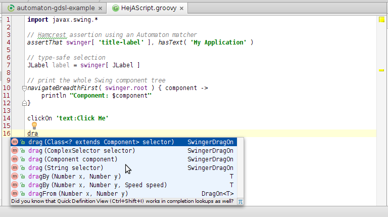

# Running Automaton Groovy scripts

The easiest way to use Automaton is by creating Automaton [Groovy](http://groovy.codehaus.org/) scripts (or AScript).

It is really simple and does not require any modification to your Java applications!

The following command shows how you would run your AScript, called `myAScript.groovy`,
to test an application `my-app.jar`:

```
java -javaagent:Automaton-1.x-all-deps.jar=myAScript.groovy -jar my-app.jar
```

You can also run several scripts in sequence by placing them all in the same directory.
For example, if you saved your scripts in a directory called `mydir`, you would run your scripts as follows:

```
java -javaagent:Automaton-1.x-all-deps.jar=mydir -jar my-app.jar
```

Automaton will only run the files with the `.groovy` extension under the given directory.
The scripts will be run in alphabetical order.

> This mechanism to run scripts supports both Swing and JavaFX application.

Script code can call all `SwingerFXer` methods directly, such as in:

```groovy
clickOn 'text:A label'
```

An instance of `Swinger` called `swinger` and its counterpart `fxer` of type `FXer` are available for the script as well,
so you can use (one of them or both, depending on whether you have a JavaFX or Swing application) them if required.

If you application has both Swing and JavaFX code (and is initialized through `FXApp.initialize`) an instance of
`SwingerFXer` can also be accessed with the name `sfxer`.

For example:

```groovy
import javax.swing.JLabel
import javafx.scene.control.TextField

// if using Swing
JLabel firstLabel = swinger[ JLabel ]

// if using JavaFX
TextField field = fxer[ TextField ]

// if using both Swing and JavaFX
JLabel firstLabel = sfxer[ JLabel ]
TextField field = sfxer[ TextField.class ]
```

You can also call any static methods or constants from the following classes:

  * `org.junit.Assert`
  * `org.hamcrest.CoreMatchers`
  * `com.athaydes.automaton.assertion.AutomatonMatcher`
  * `com.athaydes.automaton.SwingUtil`
  * `com.athaydes.automaton.Speed`

The following is a valid example of an AScript:

```groovy
doubleClickOn 'text:colors'
pause 500
clickOn 'text:yellow'

assertThat swinger[ 'status-label' ],
           hasText( 'You selected [colors, yellow]' )
```

AScripts are written in Groovy, so you can use the Groovy syntax as required:

```groovy
5.times { index ->
  clickOn "input-$index"
  moveBy( -100, 10 )
  if ( index < 4 )
    type "Hello $index"
}
```

## Code highlighting and assistance

You can write your AScripts with code-completion and highlighting with [IntelliJ IDEA](https://www.jetbrains.com/idea/).

To enable AScript support, all you have to do is add Automaton to your project's class-path. IntelliJ will then automatically
recognize any file whose name matches `*AScript.groovy` as being an Automaton script. For example:

 * LoginAScript.groovy
 * SomeTestAScript.groovy
 * AScript.groovy

Writing AScripts in IntelliJ is a pleasure:



Notice that you won't be able to run the script as you would run a normal Groovy script in IntelliJ.
